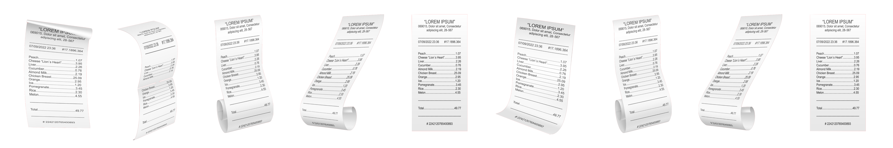

<!--- https://www.freepik.com/free-vector/realistic-set-receipt-paper-templates-grey_37077070.htm#query=long%20receipt&position=42 from_view=keyword&track=ais&uuid=e8301b97-de9d-4398-81d1-47fb8217d7d5 --->

Welcome to my SPPH 381E project website! In the vast landscape of consumerism, paper receipts hold a crucial place in the routine functioning of business transactions. Utilized across various sectors, such as grocery stores, banking, restaurants, and gas stations, receipts have become an omnipresent component of modern commerce.

## Explore


  
  
  
  
