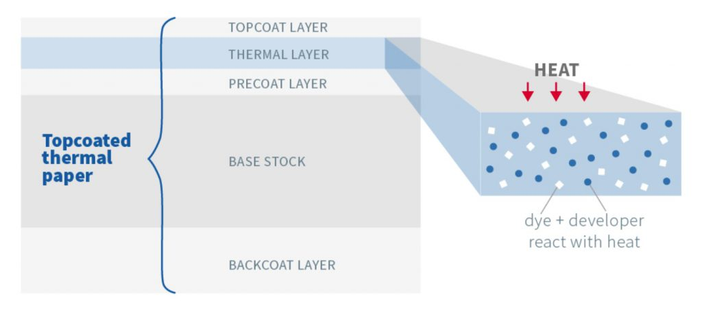

## Thermal Layer

Within the thermal layer, six chemical components facilitate a reaction when the receipt paper is exposed to heat. Critically, the agents responsible for the color change are the leuco dye, developer, and phase change materials. Although the precise composition may vary, these chemicals are commonly used:

### Leuco Dyes

Leuco Dyes are colourless (or nearly colourless) compounds that can be transformed into a coloured state by a chemical reaction. In thermal paper, leuco dyes develop colour when they react with developers. The colour change typically occurs due to a structural change in the dye molecule, which alters the way it absorbs and reflects light.

Two most common leuco dyes used (click to learn more):

<!--- Chemical Structures Crop: 1600x1200 dpi:96 --->


  
  


### Developers

Developers are chemicals that react with leuco dyes in the presence of heat to produce the colour change. Developers have acidic properties that trigger leuco dyes to change colour.

Two most common developers used (click to learn more):


  
  


### Phase Change Materials (PCM) 

Phase change materials serve as the medium within which the leuco dye and developer are embedded. When heat is applied, it melts, allowing a reaction between the leuco dye and developer.

[^1]: test