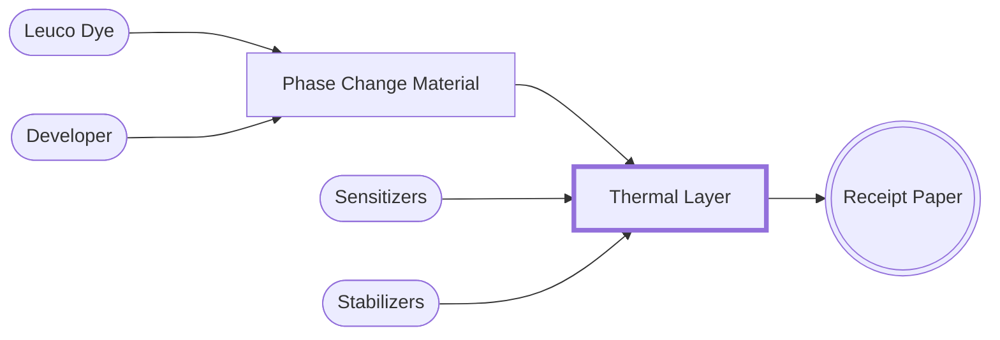

<!--- COMPLETE --->

## Thermal Layer

Within the thermal layer, five chemical components facilitate a reaction when the receipt paper is exposed to heat[^7] [^9]. 
The most critical of these are the leuco dye, developer, and phase change materials[^9] [^10] [^11] [^12].


The chemicals listed are among the most commonly used in the industry. Note that the precise composition may vary between products and manufacturers.


### Leuco Dyes

Leuco Dyes are colourless (or nearly colourless) compounds that can be transformed into a coloured state by a chemical reaction[^9] [^10]. 
In thermal paper, leuco dyes develop colour when they react with developers[^9] [^10]. 
The colour change typically occurs due to a structural change in the dye molecule, which alters the way it absorbs and reflects light[^9] [^10].

Two most common leuco dyes used (click to learn more)[^13] [^14]:

<!--- Chemical Structures Crop: 1600x1200 dpi:96 --->


  
  


### Developers

Developers trigger the colour change process by chemically reacting with the leuco dye[^7] [^8] [^9]. 
Upon the application of heat, the medium (see below) encapsulating the developers melts, releasing them to chemically react with the leuco dye[^7] [^8] [^9]. 

Two most common developers used (click to learn more)[^15] [^16]:


  
  


### Phase Change Materials (PCM) 

Phase change materials serve as the medium within which the leuco dye and developer are embedded[^7] [^9]. 
When heat is applied, it melts, allowing a reaction between the leuco dye and developer. A commonly used PCM is paraffin wax[^7] [^9].

Next, we will explore the colour-changing reaction that occurs between these critical chemicals.

[^7]: Ouyang F. Complete Guide on Thermal Paper: Composition, Advantages, Uses, and More [Internet]. Panda Paper Roll. n.d. [cited 2024 Feb 16]. Available from: [Panda Paper Roll](https://pandapaperroll.com/complete-guide-on-thermal-paper/)
[^8]: Pivnenko K, Pedersen GA, Eriksson E, Astrup TF. Bisphenol A and its structural analogues in household waste paper. Waste Manag. 2015 Oct 1;44:39–47.
[^9]: Diamond AS. Handbook of Imaging Materials [Internet]. 2nd ed. Boca Raton, FL: CRC Press; 2018 [cited 2024 Feb 23]. 695.
[^10]: Muthyala R, editor. Chemistry and Applications of Leuco Dyes [Internet]. New York, NY: Kluwer Academic Publishers; 1997. 302 p. (Topics in Applied Chemistry).
[^11]: Truitt JK. Thermal Paper Coating [Internet]. Dallas, TX; 3953659A, 1976. p. 4. Available from: [Google Patents](https://patents.google.com/patent/US3953659)
[^12]: Fukuchi T, Hamada K, Nagai T, Kudoh N, Sekine A. Thermal sensitive recording medium [Internet]. US5811368A, 1998 [cited 2024 Feb 27]. Available from: [Google Patents](https://patents.google.com/patent/US5811368A/en)
[^13]: PubChem. Fluoran [Internet]. National Library of Medicine (US), National Center for Biotechnology Information. n.d. [cited 2024 Feb 23]. Available from: [Pubchem](https://pubchem.ncbi.nlm.nih.gov/compound/68994)
[^14]: PubChem. Crystal Violet Lactone [Internet]. National Library of Medicine (US), National Center for Biotechnology Information. n.d. [cited 2024 Feb 23]. Available from: [Pubchem](https://pubchem.ncbi.nlm.nih.gov/compound/73773)
[^15]: PubChem. Bisphenol A [Internet]. National Library of Medicine (US), National Center for Biotechnology Information. n.d. [cited 2024 Mar 3]. Available from: [Pubchem](https://pubchem.ncbi.nlm.nih.gov/compound/6623)
[^16]: PubChem. 4,4’-Sulfonyldiphenol (Bisphenol S) [Internet]. National Library of Medicine (US), National Center for Biotechnology Information. n.d. [cited 2024 Mar 3]. Available from: [Pubchem](https://pubchem.ncbi.nlm.nih.gov/compound/6626)
