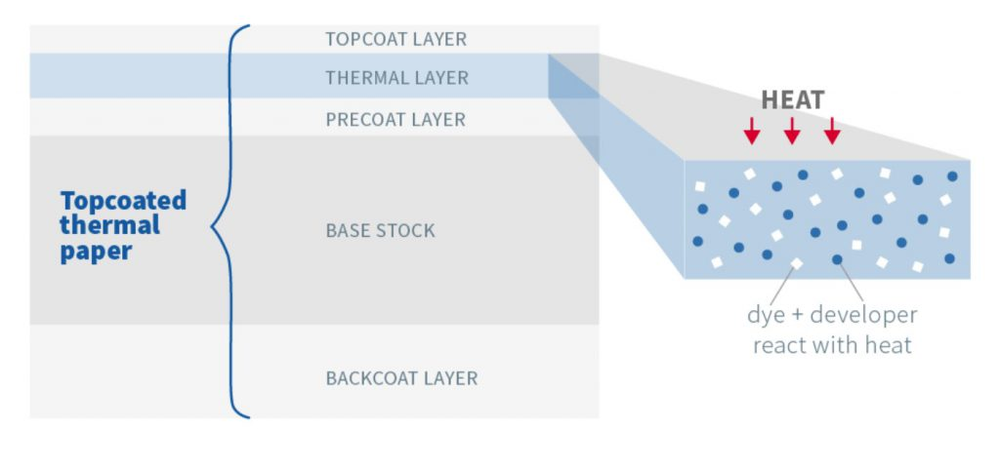

Thermal receipt paper utilizes a thermochromic process for inkless printing, achieved through its multi-layered composition. These layers, comprising the topcoat, thermal layer, base paper, precoat, and backcoat, work in concert to ensure the print's durability and clarity. Central to its function is the thermal layer, where a mix of active agents triggers the color-changing process essential for printing.

{}

### Topcoat

The **topcoat** on receipt paper, also known as the protective layer, is applied over the thermal coating to protect the thermally sensitive layer from environmental factors, abrasion, and other physical damages that could affect the print quality and longevity.

### Thermal Layer

At its core, the **thermal layer** contains a mix of active agents that undergo a colour-changing process when exposed to heat. The next section explores the layer in greater detail.

### Precoat

The **precoat** is the coating between the base paper and the thermal-sensitive layer, smoothing the base paper's surface for a uniform and precise interaction with the thermal printhead.

### Base Paper

The **base paper** constitutes the actual paper component of receipts, offering the essential stability, durability, and specific physical qualities needed for thermal printing.

### Backcoat

The **backcoat** functions as a protective layer, increasing durability and offering protection from physical and environmental damage.

{}

The image below offers a visual representation of the layers and their respective proportions.

<!--- https://www.jujothermal.com/technical-guide/thermal-paper-technology/ --->

Next, let's take a deeper look at the mechanism of action that causes the receipt paper to change colour.