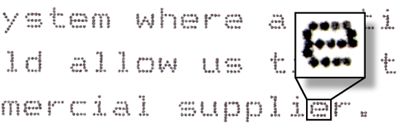
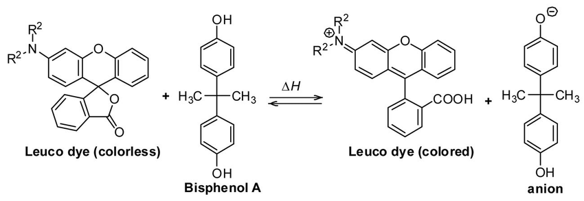

<!--- COMPLETE --->

Within the receipt printer apparatus, the thermal printhead generates heat in a precise pattern corresponding to the specified text or images[^7] [^9]. 
Heat is applied directly to the thermal receipt paper as it passes under the printhead[^7] [^9]. 
This localized heating is the trigger for the subsequent chemical reactions in the coated layer of the paper, initiating the color development process in specific areas to create the desired print[^7] [^9] [^10].

### PCM Melting

The PCM melts when exposed to the heat from the printhead[^7] [^9]. 
As the leuco dye and developer are suspended in the PCM, they are not able to interact[^7] [^9].

### Thermochromic Reaction

The developer, which is commonly BPA or BPS[^17] [^18], has acidic properties that trigger a phase change in the leuco dye[^7] [^9]. 
This event, called protonation, involves the developer donating hydrogen ions (protons) to the leuco dye[^11] [^12]. 
Adding a hydrogen ion changes the leuco dye's structure, altering how the molecule interacts with light and thus its color[^11] [^12]. 
This process is called a thermochromic reaction as it involves a change in colour triggered by temperature changes[^9] [^10] [^11] [^12]. 
The exact color produced depends on the structure of the leuco dye and the nature of the protonation[^11] [^12].

Below is an example of the chemical reaction between the leuco dye fluoran and BPA.

### Cooling

After moving beyond the printhead, the PCM starts to cool down and solidify[^7] [^9]. 
During this time, the developer and leuco dye are resuspended, albeit in an altered configuration[^9] [^10]. 
Unless heat is reapplied, printed receipt paper will maintain its chemical integrity[^7] [^9]. 
Over time, the chemical bonds in the paper start to break down, leading to a gradual fading of the print as its stability decreases[^7] [^9].

[^7]: Ouyang F. Complete Guide on Thermal Paper: Composition, Advantages, Uses, and More [Internet]. Panda Paper Roll. n.d. [cited 2024 Feb 16]. Available from: [Panda Paper Roll](https://pandapaperroll.com/complete-guide-on-thermal-paper/)
[^9]: Diamond AS. Handbook of Imaging Materials [Internet]. 2nd ed. Boca Raton, FL: CRC Press; 2018 [cited 2024 Feb 23]. 695.
[^10]: Muthyala R, editor. Chemistry and Applications of Leuco Dyes [Internet]. New York, NY: Kluwer Academic Publishers; 1997. 302 p. (Topics in Applied Chemistry).
[^11]: Truitt JK. Thermal Paper Coating [Internet]. Dallas, TX; 3953659A, 1976. p. 4. Available from: [Google Patents](https://patents.google.com/patent/US3953659)
[^12]: Fukuchi T, Hamada K, Nagai T, Kudoh N, Sekine A. Thermal sensitive recording medium [Internet]. US5811368A, 1998 [cited 2024 Feb 27]. Available from: [Google Patents](https://patents.google.com/patent/US5811368A/en)
[^17]: Bousoumah R, Leso V, Iavicoli I, Huuskonen P, Viegas S, Porras SP, et al. Biomonitoring of occupational exposure to bisphenol A, bisphenol S and bisphenol F: A systematic review. Sci Total Environ. 2021 Aug 20;783:146905.
[^18]: Gogoi A, Neog B. The dark side of thermal printed paper. Curr Sci. 2016 Jan;110(1):11–2.