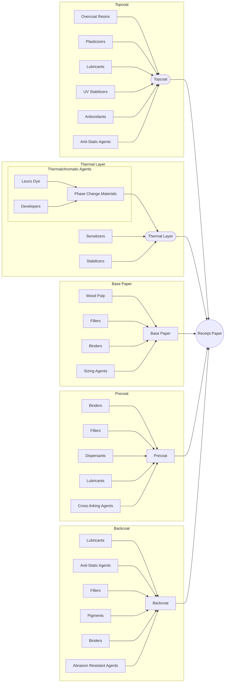

Pages can be organized into folders.

```mermaid
flowchart LR
    subgraph Thermal Layer
        subgraph Thermalchromatic Agents
            leuco[Leuco Dye] --> pcm[Phase Change Materials]
            dev[Developers] --> pcm
        end

        pcm --> tl([Thermal Layer])
        sen[Sensitizers] --> tl
        stab[Stabilizers] --> tl
    end

    subgraph Topcoat
        over[Overcoat Resins ] --> top([Topcoat])
        plac[Plasticizers] --> top
        lub1[Lubricants] --> top
        uv[UV Stabilizers] --> top
        ox[Antioxidants] --> top
        anti1[Anti-Static Agents] --> top
    end

    subgraph Base Paper
        wood[Wood Pulp] --> paper[Base Paper]
        fill1[Fillers] --> paper
        bind1[Binders] --> paper
        size[Sizing Agents] --> paper
    end

    subgraph Precoat
        bind2[Binders] --> pre[Precoat]
        fill2[Fillers] --> pre
        dis[Dispersants] --> pre
        lub2[Lubricants] --> pre
        cla[Cross-linking Agents] --> pre
    end

    subgraph Backcoat
        lub3[Lubricants] --> back[Backcoat]
        anti2[Anti-Static Agents] --> back
        fill3[Fillers] --> back
        pig[Pigments] --> back
        bind3[Binders] --> back
        ara[Abrasion Resistant Agents] --> back
    end

    top --> rp((Receipt Paper))
    tl --> rp
    paper --> rp
    pre --> rp
    back --> rp
```
